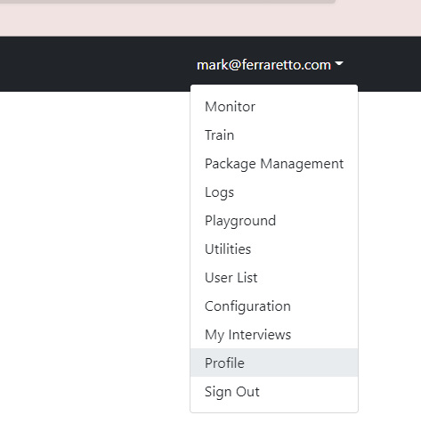

### Docassemble API Key
You need to create an API key so you can send code from VS Code to Docassemble.  Once your account is created do the following:
1. From the top-right menu in Docassemble select 'Profile'
  > 
  TODO:
  * I want to display each of these images sized as I like and aligned to the left
    or centre as I please and also with either a border around it or a nice shadow
1. From the 'Other Settings' menu select 'API Keys'
  > 
  TODO:  All these images need to be imported into the _resources folder
1. Click on 'Add a New API Key'
1. Give your new key a name (it can be anything but don't forget it!) and set the key to have no authentication
  > 
1. Click 'Create'
1. Copy the key.  You're going to need it!  You might want to paste the key somewhere so you don't lose it. You'll need it for your secrets file.
  > 

#### Create a secrets.json file.
You need to store your API key so other scripts can access it.  We'll store it in a file called `secrets.json` in your `Software` directory.
```
> cd $home\Software
> code secrets.json
```
Paste this into your new `secrets.json` file and then save it
```json
{
  "dll_api_key" : {
    "api_key"  : "YourAPIKeyGoesHere",
    "api_root" : "https://llaw3301.achelp.net/api"
  }
}
```
* Make sure you get the spacing, commas, colons and quotes correct otherwise we won't be able to process your secret properly.
* You can call your secret anything you like.  I've used `dll_api_key` in this document as an example. You can use that name too if you like!
